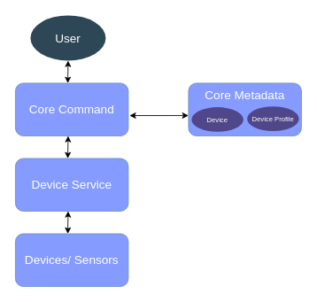

# Device Service - Device Commands
## Concept


Device commands instruct your device to take an action. If we want to know the current humidity of your device, we can send a request to core command service, which accesses the database to query information about the device and the device profile to collects the information, and passes the request to the device service, which then passes it on to the device/sensor (south side). Eventually we can get to know the current humidity of your device.

## Example and Types

Device commands specify access to reads and writes for multiple simultaneous device resources. In other words, device commands allow you to ask for multiple pieces of data from a sensor at one time (or set multiple settings at one time). 

In this example, we can request both human and dog counts in one request by establishing a device command that specifies the request for both. 

``` yaml
deviceCommands:
-
name: "Counts"
readWrite: "R"
isHidden: false
resourceOperations:
- { deviceResource: "HumanCount" }
- { deviceResource: "CanineCount" }
```

There are two types of commands that can be sent to a device.

- GET command requests data from the device. 
    - This is often used to request the latest sensor reading from the device. In most cases, GET commands are simple requests for the latest sensor reading from the device. Therefore, the request is often parameter-less (requiring no parameters or body in the request).

- SET commands request to take action or actuate the device or to set some configuration on the device.
    - SET commands require a request body where the body provides a key/value pair array of values used as parameters in the request (i.e. {"additionalProp1": "string", "additionalProp2": "string"}).
