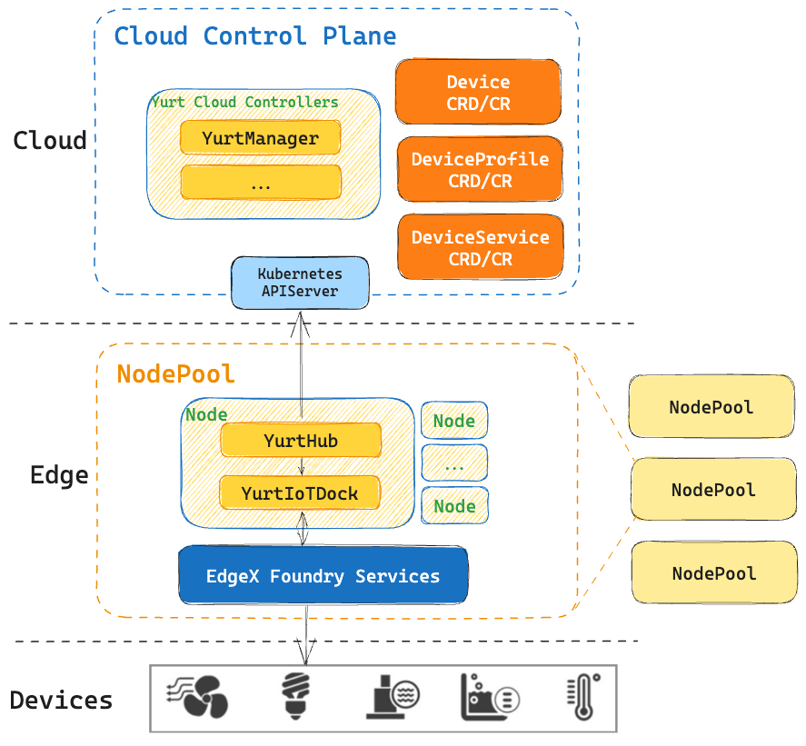
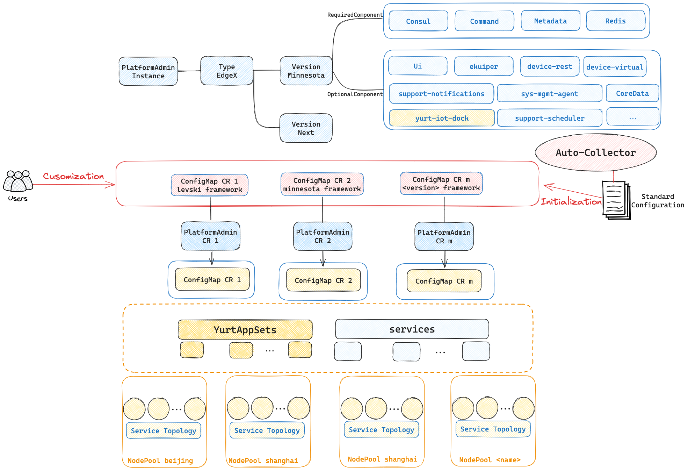
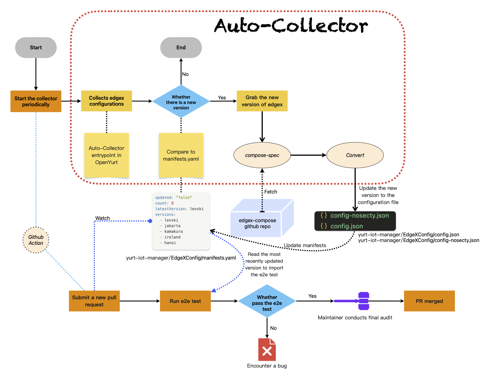

# OpenYurt

## Overview

**[OpenYurt](https://openyurt.io/) is the first edge computing platform that is non-intrusive to cloud-native systems in the industry.** It unifies the management of scattered massive edge heterogeneous resources (such as CDN sites, IoT all-in-one machines and other edge computing power) from the control side (located in the cloud or central server room, etc.). It helps users to easily complete large-scale application delivery, operation and maintenance, and control on massive edge resources.
On the IoT side, OpenYurt deeply integrates EgdeX to make edge device management more cloud-native.

## Architecture

We saw a lot of great edge device management platforms emerging in the community，such as EdgeX Foundry. Inspiring by the Unix philosophy, "Do one thing and do it well",
we believe that Kubernetes should focus on managing computing resources while edge devices management can be done by adopting existing edge computing platforms.

A overall architecture about cloud-edge-device depicted below.



The communication range of edge devices is usually limited to a certain network area. Therefore, edge nodes in the same network area can be divided into a nodepool. So a EdgeX suite and a yurt-iot-dock can be deployed in each nodepool, the yurt-iot-dock will take care of the synchronization process between Kubernetes and EdgeX, sync resources such as Device, DeviceService, and DeviceProfile to the cloud, and send commands from the cloud to EdgeX at the edge.

## YurtManager

> OpenYurt v1.4+ is recommended, as IoT capabilities are more complete and convenient in these versions.

By installing yurt-manager, users can gain access to all the capabilities for managing edge devices without any additional steps.

The yurt-manager is responsible for the deployment and administration of the EdgeX platform through the PlatformAdmin CRD. By writing PlatformAdmin yaml files, users can choose the EdgeX components they want, or modify certain configurations to customize EdgeX.

The following picture is the architecture diagram related to PlatformAdmin.



- **PlatformAdmin**：PlatformAdmin is the CRD for managing IoT systems in OpenYurt.. Users can simply provide input such as the platform to be integrated, the name of the NodePool to be deployed, the desired version, and other relevant details. This allows for the deployment of a complete edge device management platform within the specified NodePool.
- **AutoCollector**：OpenYurt relies on the AutoCollector tool for automatic adaptation and integration with EdgeX within its internal implementation. This tool has been utilized since the Jakarta release and continues to be used in the latest release, Minnesota. Going forward, OpenYurt will maintain its dependency on AutoCollector for rapid adaptation to new versions of EdgeX. This ensures efficient integration and compatibility between OpenYurt and EdgeX in future releases.
- **Component Mechanism**：In the v1.4.0 release, we have further enhanced the integration with EdgeX. The current PlatformAdmin Custom Resource (CR) supports one-click configuration of optional components. You can refer to the [Components Documentation](https://openyurt.io/docs/reference/iot/components/) for the component names to be used in the configuration. This allows for easier customization and selection of specific components within the EdgeX ecosystem through the PlatformAdmin CR.
- **PlatformAdminFramework**：In the v1.4.0 release, we introduced the Component mechanism to cater to entry-level users. Additionally, to accommodate advanced users who require customized configurations, we also provided a Framework mechanism. The configuration files corresponding to PlatformAdmin are stored in the Kubernetes cluster as ConfigMaps. Advanced users can simply modify the contents of the ConfigMap, following the native Kubernetes specifications, to customize their edge device management platform according to their specific needs.

In OpenYurt, EdgeX services are exposed to the outside world through Kubernetes Services. Despite different EdgeX instances using the same Kubernetes service name, ServiceTopology ensures that EdgeX components can only access other components belonging to the same EdgeX instance, preventing any cross-access scenarios.

The platformadmin-controller leverages the capabilities of YurtAppSet to deploy EdgeX components within a NodePool. This allows for the deployment and management of EdgeX components specifically within the designated NodePool, ensuring proper isolation and control within the OpenYurt environment.

## YurtIoTDock

We believe that the three concepts (Device, DeviceProfile, DeviceService) designed by EdgeX can reflect the basic status information of the device, and they can be nicely abstracted as Kubernetes CRDs. Interacting with the corresponding controller and edge device management platform, the discovered edge devices can be promptly mapped to the cloud. Simultaneously, the yurt-iot-dock component synchronizes modifications made to device properties on the cloud (e.g., setting the on/off state of a lighting device) to the edge devices, thereby affecting the physical devices in the real world. Users can achieve the goal of operating and managing complex edge devices in a cloud-native manner by declaratively modifying the corresponding fields of CRs. The following are the three components that constitute the yurt-iot-dock:

- **Device controller**: It can abstract device objects in the edge platform into device CRs and synchronize them to the cloud. With the support of device controller, users can influence the actual device on the edge platform through the operation of cloud device CR, such as creating a device, deleting a device, updating device attributes (such as setting the light on and off, etc.).
- **DeviceService controller**: It can abstract deviceService objects in the edge platform into deviceService CRs and synchronize them to the cloud. With the support of deviceService Controller, users can view deviceService information of edge platforms in the cloud, and create or delete deviceService CRs to affect the actual deviceService of edge platforms.
- **DeviceProfile controller**: It can abstract deviceProfile objects in the edge platform into deviceProfile CRs and synchronize them to the cloud. With the support of deviceProfile Controller, users can view deviceProfile information of edge platforms in the cloud, and create or delete deviceProfile CRs to affect the actual deviceService of edge platforms.

## AutoCollector

AutoCollector is a component responsible for automatically collecting and synchronizing information about edge components. The platformadmin-controller reads standardized configuration files collected by AutoCollector and uses them as templates to deploy EdgeX components. When a new version of EdgeX becomes available, OpenYurt automatically synchronizes with it, reducing the manual effort required for frequent adaptation to new versions. Additionally, AutoCollector is responsible for converting single-architecture images of EdgeX components into multi-architecture images and synchronizing them to the OpenYurt repository. This ensures compatibility and availability of EdgeX components across different architectures in the OpenYurt environment.

With the help of AutoCollector, OpenYurt has already achieved support for all versions of EdgeX starting from Hanoi. In the future, AutoCollector will continue to be utilized to quickly keep pace with updates in EdgeX versions. This ensures that OpenYurt remains compatible with the latest releases of EdgeX and can efficiently adapt to any changes or enhancements introduced in subsequent versions.



## Tutorial

yurt-iot-dock is used as a component of the PlatformAdmin CR and can be deployed to the corresponding node pool by adding it to PlatformAdmin, for example:

```yaml
apiVersion: iot.openyurt.io/v1alpha2
kind: PlatformAdmin
metadata:
  name: edgex-sample
spec:
  version: minnesota
  poolName: hangzhou
  components:
  - name: yurt-iot-dock
```

Similarly, by removing yurt-iot-dock from the components list, you can cancel the deployment of yurt-iot-dock in the corresponding NodePool. This allows you to selectively control which components are deployed within specific NodePools.

**For details, see [Cloud Native Device Management](https://openyurt.io/docs/user-manuals/iot/edgex-foundry/).**

## Learn more

- [Get started deploying EdgeX using OpenYurt](https://openyurt.io/docs/user-manuals/iot/edgex-foundry)
- [Learn more about OpenYurt's IoT components](https://openyurt.io/docs/core-concepts/yurt-iot-dock/)
- [Learn about other features of OpenYurt](https://openyurt.io/docs/)
- [OpenYurt's GitHub repo](https://github.com/openyurtio/openyurt)
